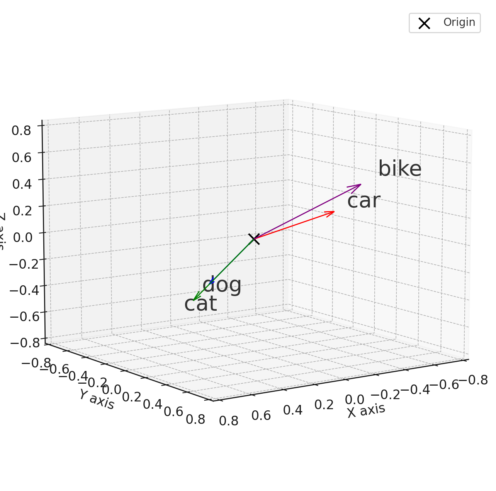

# Understanding Neural Networks
###### *Author: Mikhail Sidorenko*
###### *2024*

---
## 1.1 The History of Neural Networks
### 1.1.1 The Pre-Computing Era
#### The McCulloch-Pitts Model
The very first attempt at creating a neural network was made in 1943 by neurophysiologist **Warren McCulloch** and mathematician **Walter Pitts**, after authoring a whitepaper titled *A Logical Calculus of the Ideas Immanent in Nervous Activity*[^1]. The goal of the paper was to gain a better understanding of how the mammalian brain functions. This is important to note because, at that time, their goal was not to create Artificial Intelligence, this topic will be touched on later. To practically demonstrate their theory, they created a simple neural network in the form of an electrical circuit[^2], which was, quite predictably, very limited in its capabilities, mainly due to its incredibly simplistic nature. None the less, their work set the stage for future advancements in neural network research.

#### The Emergence of Hebbian Learning
6 years later, in 1949, **Donald Hebb** published *The Organization of Behaviour*[^3], where he introduced the concept of **Hebbian learning**[^4]. He argues that if two neurons fire at the same time, the connection between them is reinforced. This concept is fundamental to our understanding of learning processes in the brain and serves as the basis for many theories of synaptic plasticity.

Hebb's research laid the foundation for research into neural plasticity and the mechanisms underlying learning and memory. His concept of Hebbian learning has had a profound impact on both neuroscience and artificial intelligence, shaping not only our understanding of how neural networks adapt and learn from experience, but also increasing our understanding of how we as humans learn.

Today, Hebbian learning remains a key concept in computational neuroscience and machine learning, with applications ranging from the development of learning algorithms in artificial neural networks to the study of synaptic plasticity in biological systems.

### 1.1.2 The Beginning of The Computing Era

#### Perceptron
The **perceptron**[^5], developed by **Frank Rosenblatt** in 1957, stands as one of the pioneering computational models of neural networks. Comprising a single layer of interconnected artificial neurons, the perceptron operates by aggregating weighted inputs and applying an activation function to produce an output. It was conceived with the aim of classifying input patterns into distinct categories based on a linear decision boundary. The perceptron learning rule, a form of supervised learning, allowed for iterative adjustment of connection weights to minimize classification errors during training. Although celebrated for its simplicity and potential applications in pattern recognition and artificial intelligence, the perceptron was limited by its inability to handle non-linearly separable data, a restriction that prompted further research into more complex neural network architectures and learning algorithms. Nonetheless, the perceptron's introduction marked a significant milestone in the early exploration of neural computation and laid the foundation for subsequent advancements in the field.

#### ADALINE
In 1960 **Bernard Widrow** and **Marcian Hoff** of Stanford University developed a revolutionary neural network named "ADALINE"[^6] (Adaptive Linear Neuron), a variation of the earlier Perceptron, marking a significant advancement in the realm of neural network research. It addressed some of the Perceptron's limitations, namely its inability to handle linearly inseparable data. Adaline introduced a continuous linear activation function and used a gradient descent algorithm for weight adjustment during training. These improvements enabled ADALINE to adapt and learn from more complex input patterns, paving the way for more sophisticated neural network architectures and training algorithms.

The introduction of ADALINE marked a crucial milestone in the evolution of neural network research, demonstrating the potential of computational models inspired by the brain to tackle real-world problems in pattern recognition, classification, and artificial intelligence.

#### MADALINE
In 1962, **Bernard Widrow** with a team consisting of his students at Stanford University introduced another groundbreaking neural network model named "MADALINE"[^6] (Multiple Adaptive Linear Neurons). Building upon the foundation laid by ADALINE, MADALINE represented a significant advancement in the field of neural network research. Unlike its predecessor, which consisted of a single layer of neurons, MADALINE featured multiple layers of adaptive linear neurons, arranged in a hierarchical fashion. This architectural innovation allowed MADALINE to capture more complex patterns and relationships in the input data, making it suitable for a wider range of classification tasks. By incorporating multiple layers of adaptive neurons, MADALINE demonstrated enhanced flexibility and discriminative power, enabling it to tackle challenging classification problems that were beyond the capabilities of single-layer models like the perceptron and ADALINE. The introduction of MADALINE marked a pivotal moment in the evolution of neural network research, laying the groundwork for the development of deeper and more powerful neural network architectures in the years to come.

### 1.1.3 Transition to the era of modern neural networks
The factor most responsible for the rapid evolution of neural networks into the marvels of computer science we know today, is the identically rapid development of processor technology, with the GPU (Graphics Processing Unit) and its unrivalled ability to perform a massive amount of simultaneous calculations being the lifeblood of the Artifical Intelligence Models that we use today, with other revolutionary discoveries in the fields of Mathematics, Computer Science, and microprocessor manufacturing proving themselves to be the main driving factor of the recent advancements in computing technology.

Today, Machine Learning is a widely adopted technology, powering everything from Instagram's and YouTube's suggestion algorithms, to the computer vision and pathfinding models behind navigation apps like Google Maps and Yandex Maps. Other notable use cases include audio processing models which remove background noise from audio (like Krisp, used by discord and nvidia Broadcast which works as a virtual input device) and computer vision models specialised for facial recognition, which is the technology powering snapchat's facial filters.

## 1.2 The Advent of Generative AI
### 1.2.1 The Big (Generative AI) Bang
The beginning of the 2020s saw a boom in the popularity of AI Generative AI models, with Models like OpenAI's DALL-E and ChatGPT, Meta's (formerly Facebook) LLaMA (among others) becoming household names. Their explosive rise to fame can be attributed to a long list of factors, including but not limited to:

1. High performance
2. Extensive training
3. Ease of interaction
4. Availability

As mentioned previously, machine learning models have been a part of our daily lives for a while now, but they were never the primary attraction or product of any given platform or application developed for use by the general population. With the rise of Natural Language Processing Models, people were now able to interact directly with Machine Learning models with little abstraction, and more importantly, their ability to process natural language made them available to an enormous amount of people because they no longer required any programming expertise. These advancements allowed these models to go from working in the background for the sake of supporting an application or completing a specific task, to being the main product which can be used to perform a variety of tasks which can be completed using natural language. Note: code is not natural language, but LLMs can easily be trained to read and write code as well.

Regarding availability: Never before have Generative AI models been as easily accessible as today, with OpenAI's ChatGPT 3.5 being available for no cost at all as an example. Consumers are even given the option of running Generative AI models on their own machines, with [Ollama](https://www.ollama.com) being a popular option for storing, running, and interacting with many text-to-text models on your own machine. With many being compact enough to run very well on Laptops with no need for a GPU, Meta's LLaMA 2 being a perfect example thereof.

### 1.2.2 LLMs and GPTs
I will focus on LLMs (Large Language Models) like ChatGPT (Chat Generative Pre-trained Transformer) and LLaMA (Large Language Model Meta AI) for this section, as they are the most popular at the moment. For extra clarification, these models and others, like StableDiffusion based models and DALL-E, belong to the Generative AI group of AI models. As the name implies, they exist to generate an output based on an input. ChatGPT and LLaMA are text-to-text models, meaning they generate output in the form of text from a text input. StableDiffusion and DALL-E models generate an image based on text input, making them text-to-image models.

### 1.2.3 Text-to-text Models and the birth of the AI assistant
Text-to-text LLMs exist to do one thing, predict to the best of their ability the word most likely to appear next in a sequence of words given to them as an Input, which is split into individual tokens. Each token has its own embedding value, with related words having embedding values close to each other. This allows LLMs to associate words with each other without understanding their inherent meaning, more on this in [the notes on this section](#LLM-sentience). This can be visualised in a 3D space using vectors [like I've done in this python notebook](https://colab.research.google.com/drive/1s4KNZgQsfOAxdo0wteSfJUTYylRVH7l3?usp=sharing).

*please note that these embedding values are not accurate at all, and the values were adjusted to make them easier to see, a real dictionary of embedding values would be **massive** and difficult to interpret visually. This is just a representation of what embedding values **might** look like.*

[*same thing in desmos if you want to move the view around*](https://www.desmos.com/3d/3216881974)

#### AI Assistants

Using some creative prompt engineering, one can make LLMs act as a virtual assistant:

*User: How can I convert a column of data in a pandas dataframe to their product of the sigmoid function?*

*Assistant:*

With this Prompt, the model does not pretend to be an assistant, instead it attempts to predict how this imaginary conversation between a user and assistant *could* unfold by predicting which words are most likely to follow, using *Assistant:* as a starting point. Very similar to how character's lines are written out in plays. It guesses which word is most likely to come next in accordance with its training, which consists of the data it was trained on and the weighted values and biases of each of its billions of connections. These models go through extensive fine-tuning and output filtering to prevent them from answering certain questions, like ones regarding unethical or illegal activities.

These Assistants have become the Vanguard of the AI-Explosion, with everyone from students to researchers and everything inbetween using them for a smorgasbord of tasks.

#### Notes regarding AI assistants
These models are not without their flaws, and some of their most notable shortcomings include their eagerness to be as helpful as possible, and a lack of assertiveness. 

Their lack of assertiveness just stems from their training-goal of being as respectful and helpful as possible, this makes it easy to gaslight some LLMs into "believing" something that's factually incorrect or goes directly against the information it was trained on, which leads to some humours screenshots of conversations often shared on reddit and other platforms. 

It is also important to note that LLMs are not sentient, meaning they *do not understand* any of the text you feed them as input or the text they return as the output, nor are they capable of understanding logic and reason. 

Most AI assistants, depending on the prompt and what led up to the prompt, will sometimes experience so called ***hallucinations***. These appear most commonly when the model is handed a prompt it's not equipped to handle, often due to a lack of training data on the topic at hand. However, due to their training and fine-tuning, they will often attempt to provide a response with the data that the model *has* been trained on, which results in an inaccurate or factually incorrect response at best, and complete gibberish at worst. This is what the warning below the prompt field of [ChatGPT's chat window](https://chat.openai.com) alludes to.

[^1]: [*McCulloch, W. S., & Pitts, W. (1943). A Logical Calculus of the Ideas Immanent in Nervous Activity. Bulletin of Mathematical Biophysics, 5(4), 115-133*](https://home.csulb.edu/~cwallis/382/readings/482/mccolloch.logical.calculus.ideas.1943.pdf)

[^2]: [*Neural Network Conceptual Diagram*](https://www.researchgate.net/publication/323465059/figure/fig2/AS:599207769554946@1519873673906/McCulloch-Pitts-computational-model-of-a-neuron.png)

[^3]: [*Hebb, D. O. (1949). The Organization of Behavior. Wiley & Sons*](https://pure.mpg.de/rest/items/item_2346268_3/component/file_2346267/content)

[^4]: [*Hebbian theory wikipedia page*](https://en.wikipedia.org/wiki/Hebbian_theory#:~:text=The%20theory%20attempts%20to%20explain,for%20education%20and%20memory%20rehabilitation)

[^5]: [*Perceptron neural network*](https://en.wikipedia.org/wiki/Perceptron)

[^6]: [*ADALINE and MADALINE neural networks*](https://en.wikipedia.org/wiki/ADALINE/)
